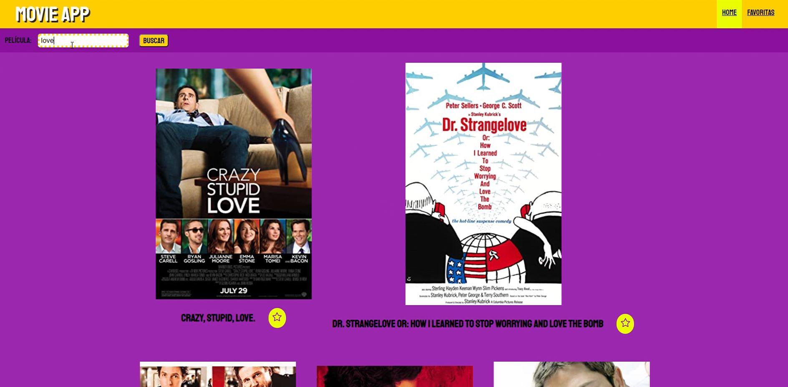
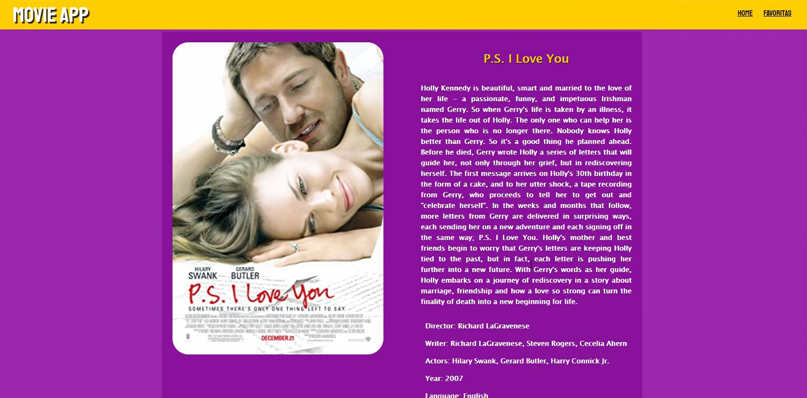
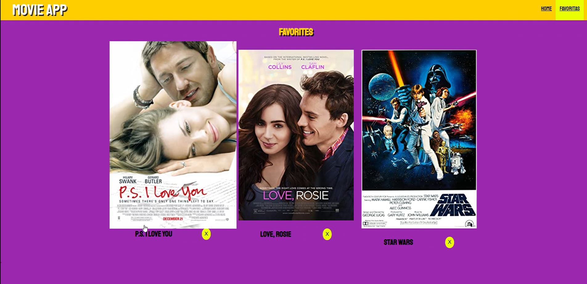

# Movie App
This is a basic proyect of API's use from http://www.omdbapi.com/

You can find a list of movies, add to a favorite list, look the movie details and delete the movies from your favorite list.

#SoyHenry Bootcamp

## Try it out
After clone this respository, open the project console.
 
Inside, run the command line: npm install.
 
Then: npm start.

## Deploy
Or you can try it at: 
<a href="https://aleespinozama.github.io/movie-app/">Movie App </a>

## Project Screens
Home:

Detail:

Favorites:

